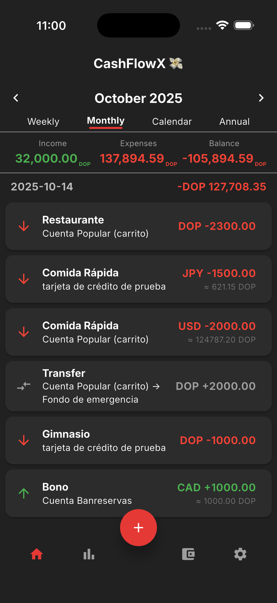
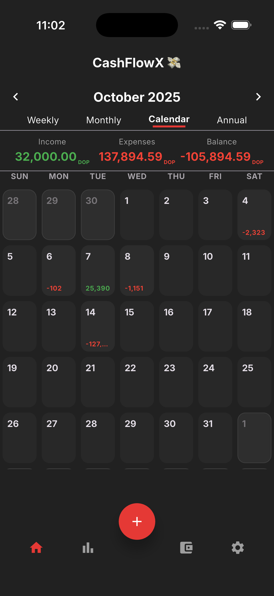
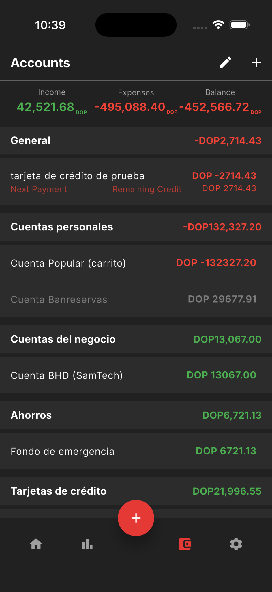
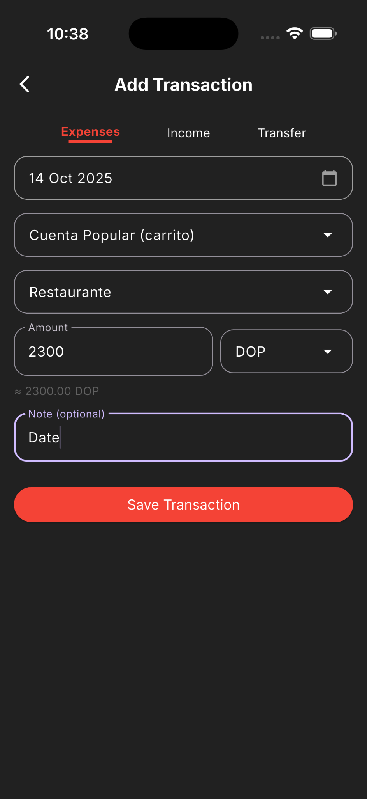
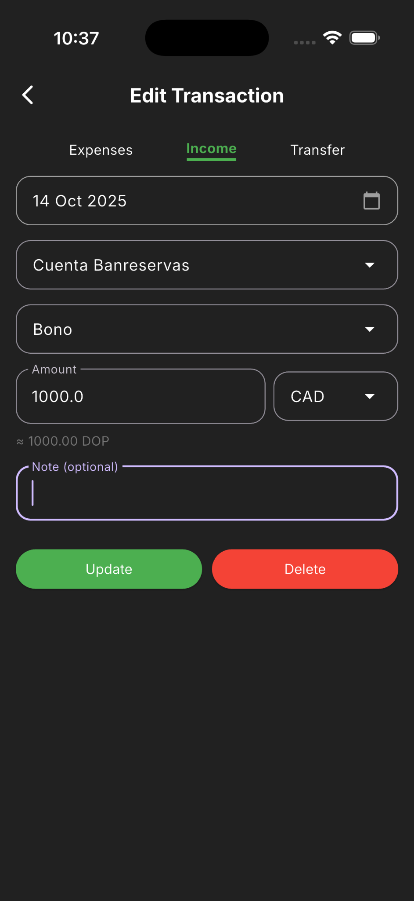
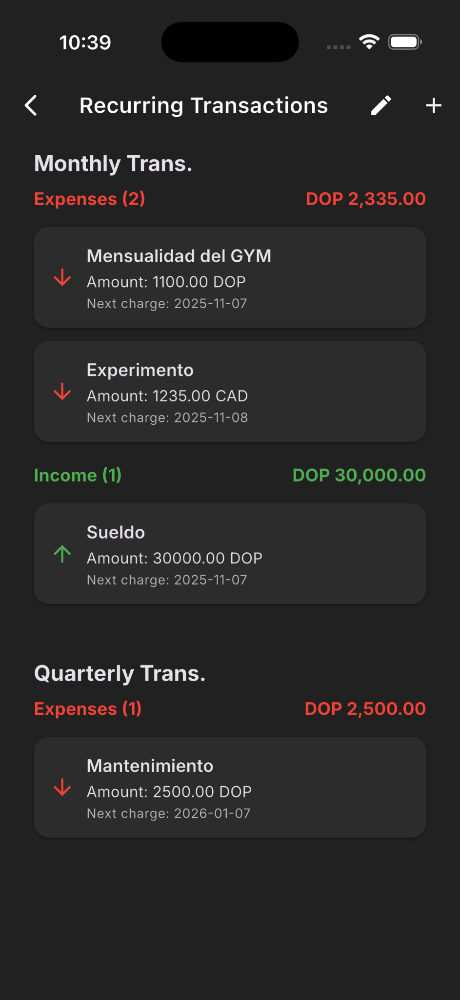
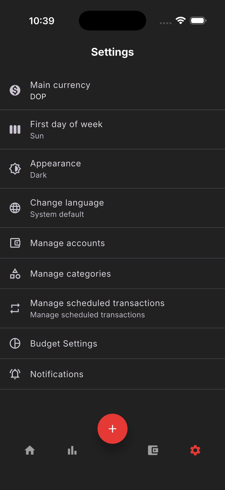
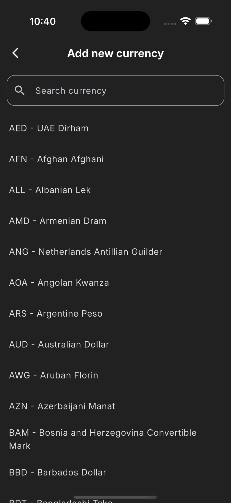
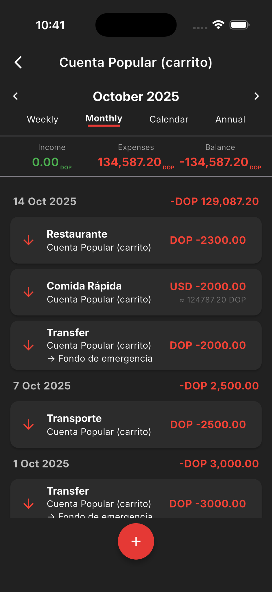

# 💸 CashFlowX

> **CashFlowX** is a modern personal finance mobile app built with **Flutter**, designed to simplify the way users track and manage their money.  
> It offers a clean, intuitive, and visually appealing interface for logging transactions, organizing accounts, setting budgets, and monitoring your financial progress.

---

## 🚀 Key Features

- 💰 **Transactions Management** — Add, edit, and delete incomes, expenses, or transfers with full control.
- 🏦 **Multiple Accounts** — Handle personal, business, savings, or credit card accounts.
- 🌍 **Multi-Currency Support** — Convert between global currencies in real-time.
- 📆 **Smart Views** — Analyze your balance by week, month, year, or calendar.
- 🔁 **Recurring Transactions** — Automate salary, bills, or subscriptions.
- 🎯 **Budgets & Goals** — Set financial goals and track your spending habits.
- 🌙 **Dark Mode** — Fully optimized for light and dark themes.
- 🌐 **Multi-Language** — English & Spanish supported.
- 📶 **Offline Mode** — Works fully offline using **SQLite**, with optional **Firebase sync**.

---

## 🧠 Tech Stack

| Layer | Technology |
|-------|-------------|
| **Framework** | Flutter 3.x |
| **Language** | Dart |
| **State Management** | Provider |
| **Database** | SQLite |
| **Backend / Cloud Sync** | Firebase |
| **Localization** | easy_localization |
| **External APIs** | Currency conversion APIs |
| **Architecture** | Clean Architecture + MVVM Pattern |

---

## 📱 App Preview

| Dashboard | Calendar | Accounts |
|------------|-----------|----------|
|  |  |  |

| Add Transaction | Edit Transaction | Recurring Transactions |
|------------------|------------------|-------------------------|
|  |  |  |

| Settings | Currency Selector | Account Detail |
|-----------|------------------|----------------|
|  |  |  |

> *All screenshots taken from the iOS simulator during active development.*

---

## 🧩 Project Structure

